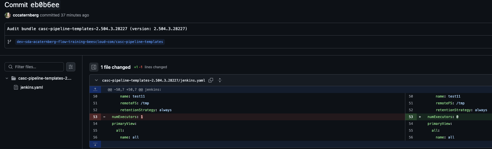

# 📦 `bundleutils` Kubernetes CronJob Integration

This document describes how to deploy and operate `bundleutils` using a **Kubernetes CronJob**.

🔢 See: [cronjob.yaml](helm/bundleutils-chart/templates/cronjob.yaml)

---

## 📁 Resource Overview

| Resource                                                         | Description                                     |
| ---------------------------------------------------------------- | ----------------------------------------------- |
| [`00-verify.sh`](00-verify.sh)                                   | Validates prerequisites and environment         |
| [`01-readJobLogs.sh`](01-readJobLogs.sh)                         | Retrieves logs from `CronJob → Job → Pod`       |
| [`Helm Chart bundleutils`](helm/bundleutils-chart/README.md)     | Helm Chart to deploy `bundleutils` as a CronJob |
| [`yaml/bu-test-pod-git-ssh.yaml`](yaml/bu-test-pod-git-ssh.yaml) | Test pod to validate SSH Git connectivity       |

---

## ⚙️ Prerequisites

* A dedicated **GitHub repository**
  * See [Create a GitHub Repository](https://docs.github.com/en/repositories/creating-and-managing-repositories/creating-a-new-repository) 
    * You can name it for example `bundleutils-audit` so the repo URL looks like  `git@github.com:<YOUR_GH_ORG>/bundleutils-audit.git`
  * GitHub `https` or other Git servers/types is not implemented in this setup 
* **SSH key-based authentication** for GitHub

  * [GitHub SSH Guide](https://docs.github.com/en/authentication/connecting-to-github-with-ssh)
  * [Using multiple GitHub accounts with SSH](https://stackoverflow.com/questions/3225862/multiple-github-accounts-ssh-config)
* A **CloudBees CI controller** running on Kubernetes with:

  * Admin user ID
  * Admin API token (`JENKINS_TOKEN`)
* Kubernetes access configured (e.g. `export KUBECONFIG=...`)
* Required CLI tools:

  * `yq`, `kubectl`, `git`, `ssh`, `ssh-keyscan`, `helm`

---

## 🛠 Prepare SSH Configuration

Create the following three files:

* SSH privatekey (see [GitHub SSH Guide](https://docs.github.com/en/authentication/connecting-to-github-with-ssh))
* SSH config
* SSH known_hosts

### 1. Create SSH `known_hosts` File

```bash
# Create a directory to hold the SSH files
mkdir -p k8s-git-ssh-secret

# Populate known_hosts with GitHub entries
ssh-keyscan -p 443 -H ssh.github.com | sed 's/^#\s//g ' | tee  k8s-git-ssh-secret/known_hosts
ssh-keyscan -H github.com | sed 's/^#\s//g ' | tee -a  k8s-git-ssh-secret/known_hosts
```

### 2. Copy SSH Private Key

```bash
# Replace with your private key path
cp <PATH_TO_YOUR_GITHUB_PRIVATE_KEY> k8s-git-ssh-secret/privateKey
chmod 600 k8s-git-ssh-secret/privateKey
```

### 3. Create SSH `config` File

#### GitHub Example

Replace `<YOUR_GITHUB_USER_ID>` with your actual GitHub username:

```bash
cat <<EOF > k8s-git-ssh-secret/config
Host github.com
    User <YOUR_GITHUB_USER_ID>
    Hostname ssh.github.com
    AddKeysToAgent yes
    PreferredAuthentications publickey
    IdentitiesOnly yes
    IdentityFile /root/.ssh/privateKey
    Port 443
EOF
```

#### Bitbucket (Cloud, not yet tested on Server)

```bash
cat <<EOF > k8s-git-ssh-secret/config
Host bitbucket.org
    HostName bitbucket.org
    User <YOUR_BB_USER>
    AddKeysToAgent yes
    PreferredAuthentications publickey
    IdentitiesOnly yes
    IdentityFile ~/.ssh/privateKey
EOF
```

### 4. Verify Directory Structure

```bash
tree k8s-git-ssh-secret
k8s-git-ssh-secret/
├── config
├── privateKey
└── known_hosts
```

### 5. Verify SSH Setup

```bash
./00-verify.sh
```

---

## ⚙️ Install via Helm

Refer to: [bundleutils Helm Chart README](helm/bundleutils-chart/README.md)

---

## ⏳ Retrieve Logs

The CronJob may take 1-2 minutes to run the first job. If logs are not yet available, retry until the job has started.

```bash
./01-readJobLogs.sh <YOUR_NAMESPACE>
```

### Example Output (Excerpt)

```
➜  k8s:(main) ✗ ./01-readJobLogs.sh cjoc1
📋 Verifying CronJob exists:
NAME                SCHEDULE      TIMEZONE   SUSPEND   ACTIVE   LAST SCHEDULE   AGE
bundleutils-audit   */2 * * * *   <none>     False     0        107s            60m
⏳ Waiting for the first job to be created...
✅ Found job: bundleutils-audit-XXX
BUNDLEUTILS_CACHE_DIR=/opt/bundleutils/.cache
BUNDLEUTILS_JENKINS_URL=https://XXXX.beescloud.com/
BUNDLEUTILS_PASSWORD=XXXXX
BUNDLEUTILS_RELEASE_HASH=
BUNDLEUTILS_RELEASE_VERSION=
BUNDLEUTILS_USERNAME=XXX
.........

DITING: GIT_AUTHOR_EMAIL=acaternberg@cloudbees.com
AUDITING: Running gitleaks check with gitleaks version 8.26.0
AUDITING: No GITLEAKS_CONFIG found in env.
AUDITING: GITLEAKS_USE_EMBEDDED_CONFIG=true. Using embedded config: /opt/bundleutils/work/examples/tutorials/auditing/.gitleaks.toml
AUDITING: Running gitleaks check on staged files...

    ○
    │╲
    │ ○
    ○ ░
    ░    gitleaks

3:42PM INF 1 commits scanned.
3:42PM INF scanned ~29 bytes (29 bytes) in 257ms
3:42PM INF no leaks found
AUDITING: casc-pipeline-templates-2.504.3.28227 - Gitleaks check PASSED (staged files).
 casc-pipeline-templates-2.504.3.28227/jenkins.yaml | 2 ++
 1 file changed, 2 insertions(+)
AUDITING: casc-pipeline-templates-2.504.3.28227 - Git check. Committed changes.
[dev-sda-acaternberg-flow-training-beescloud-com/casc-pipeline-templates b731d28] Audit bundle casc-pipeline-templates-2.504.3.28227 (version: 2.504.3.28227)
 1 file changed, 2 insertions(+)
AUDITING: Commit: YOUR_GIT_REPO/commit/b731d28 Audit bundle casc-pipeline-templates-2.504.3.28227 (version: 2.504.3.28227)
AUDITING: casc-pipeline-templates-2.504.3.28227 - Git check. Pushed changes.
To github.com:org-caternberg/ci-bundle-util-audit.git
   eb0b6ee..b731d28  dev-sda-acaternberg-flow-training-beescloud-com/casc-pipeline-templates -> dev-sda-acaternberg-flow-training-beescloud-com/casc-pipeline-templates
AUDITING: Pushed to YOUR_GIT_REPO/tree/dev-sda-acaternberg-flow-training-beescloud-com/casc-pipeline-templates
AUDITING: Bundle audit complete. Showing last commits if any...
b731d28 Sat Jul 12 15:42:09 2025 +0000 - Audit bundle casc-pipeline-templates-2.504.3.28227 (version: 2.504.3.28227)
 casc-pipeline-templates-2.504.3.28227/jenkins.yaml | 2 ++
 1 file changed, 2 insertions(+)

eb0b6ee Sat Jul 12 15:28:09 2025 +0000 - Audit bundle casc-pipeline-templates-2.504.3.28227 (version: 2.504.3.28227)
 casc-pipeline-templates-2.504.3.28227/jenkins.yaml | 2 +-
 1 file changed, 1 insertion(+), 1 deletion(-)

1af3848 Sat Jul 12 12:28:09 2025 +0000 - Audit bundle casc-pipeline-templates-2.504.3.28227 (version: 2.504.3.28227)
 casc-pipeline-templates-2.504.3.28227/bundle.yaml  |  13 +
 casc-pipeline-templates-2.504.3.28227/items.yaml   | 603 +++++++++++++++++++++
 casc-pipeline-templates-2.504.3.28227/jenkins.yaml | 329 +++++++++++
 casc-pipeline-templates-2.504.3.28227/plugins.yaml | 152 ++++++
 casc-pipeline-templates-2.504.3.28227/rbac.yaml    |  22 +
 5 files changed, 1119 insertions(+)

1c65160 Sat Jul 12 12:26:05 2025 +0200 - Automated update
 timestamp.txt | 2 +-
 1 file changed, 1 insertion(+), 1 deletion(-)

2542a18 Sat Jul 12 09:56:20 2025 +0000 - Auto update from k8s pod
 README.md | 1 +
 1 file changed, 1 insertion(+)

7b18b66 Sat Jul 12 09:52:11 2025 +0000 - Audit bundle casc-pipeline-templates (version: 2.504.3.28227)
 casc-pipeline-templates/bundle.yaml  |  13 +
 casc-pipeline-templates/items.yaml   | 603 +++++++++++++++++++++++++++++++++++
 casc-pipeline-templates/jenkins.yaml | 328 +++++++++++++++++++
 casc-pipeline-templates/plugins.yaml | 152 +++++++++
 casc-pipeline-templates/rbac.yaml    |  22 ++
 5 files changed, 1118 insertions(+)

b6157ca Sat Jul 12 09:50:30 2025 +0000 - Auto update from k8s pod
 README.md | 1 +
 1 file changed, 1 insertion(+)

8b2f1c0 Sat Jul 12 11:27:49 2025 +0200 - Automated update
 timestamp.txt | 1 +
 1 file changed, 1 insertion(+)
######################################
AUDITING: Summary of the audit so far:
######################################

AUDITING: casc-pipeline-templates-2.504.3.28227 - Gitleaks check PASSED (staged files).
AUDITING: casc-pipeline-templates-2.504.3.28227 - Git check. Committed changes.
AUDITING: casc-pipeline-templates-2.504.3.28227 - Git check. Pushed changes.
######################################

```

A visual diff for the commit:



---

## 🥺 Optional: Test Git Connectivity via SSH

You may verify Git SSH access via a simple test pod:

```bash
kubectl apply -f yaml/bu-test-pod-git-ssh.yaml
```

---
